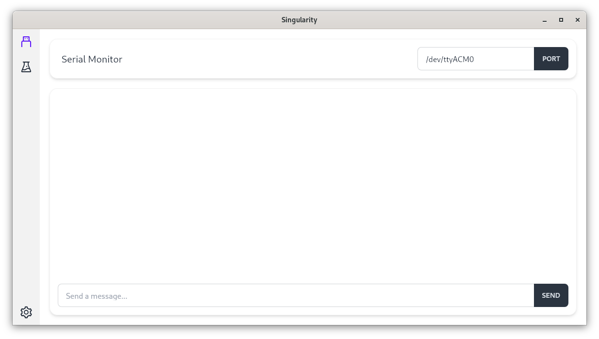

# Singularity 

[](https://skillicons.dev)

A device manager designed for interacting with Quanta Rocketry's systems (and any other serial devices).

## Usage

This project uses a mix of nix-shell and justfile.

```sh
nix-shell 
```

```sh
just install
just dev
```

## Installation

### Debian-Based

```sh
sudo apt install \
  build-essential \
  curl \
  wget \
  file \
  libxdo-dev \
  libssl-dev \
  librsvg2-dev \
  libsoup-3.0-dev \
  libayatana-appindicator3-dev \
  libwebkit2gtk-4.1-dev \
  libjavascriptcoregtk-4.1-dev
```

## Screenshots


